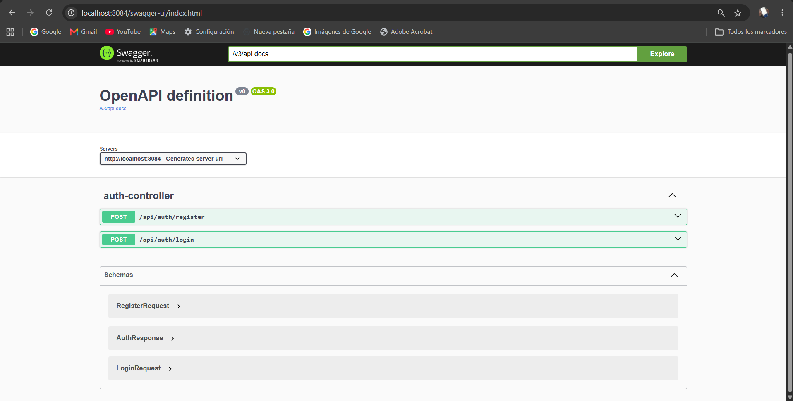
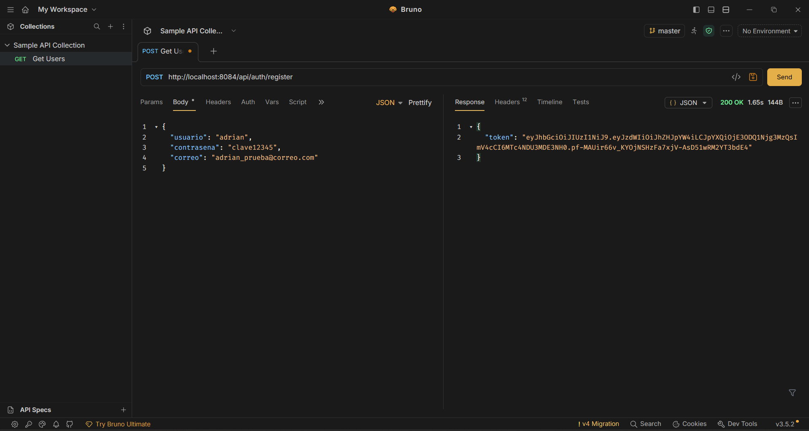
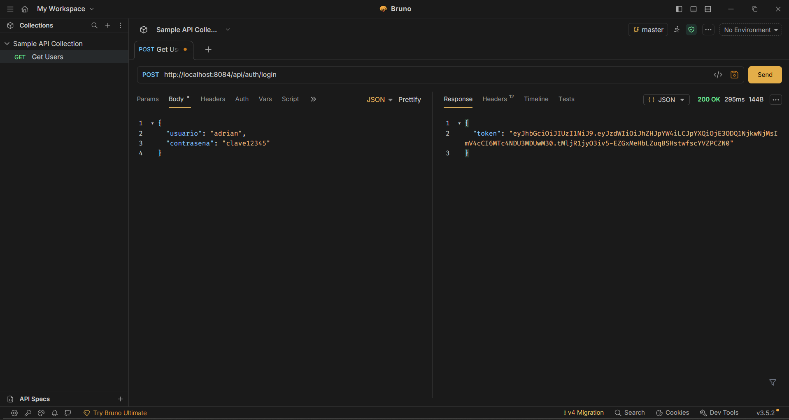
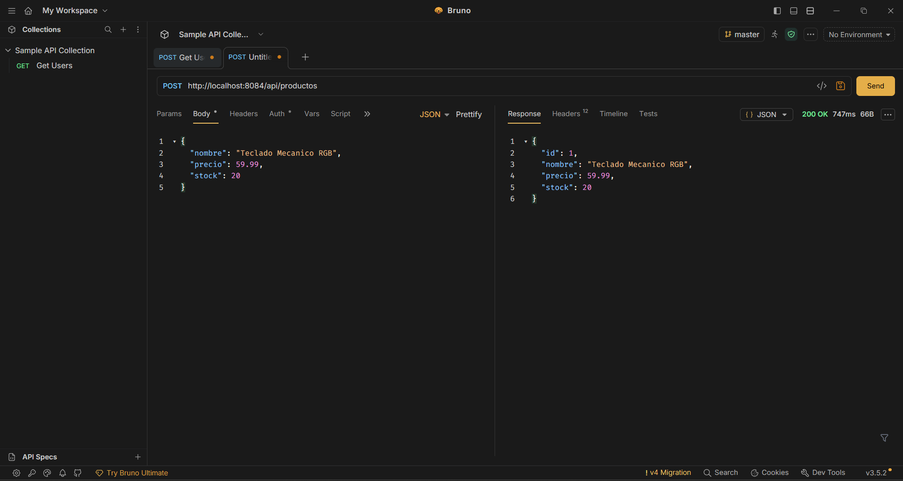
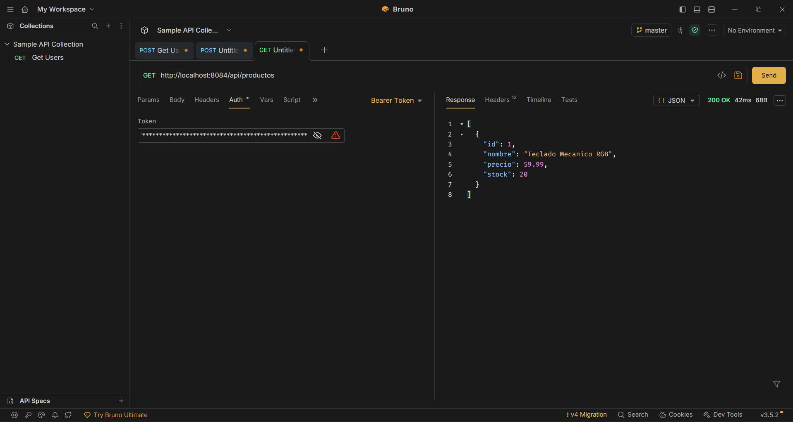
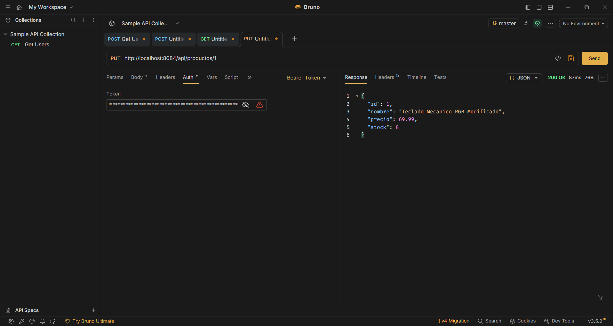
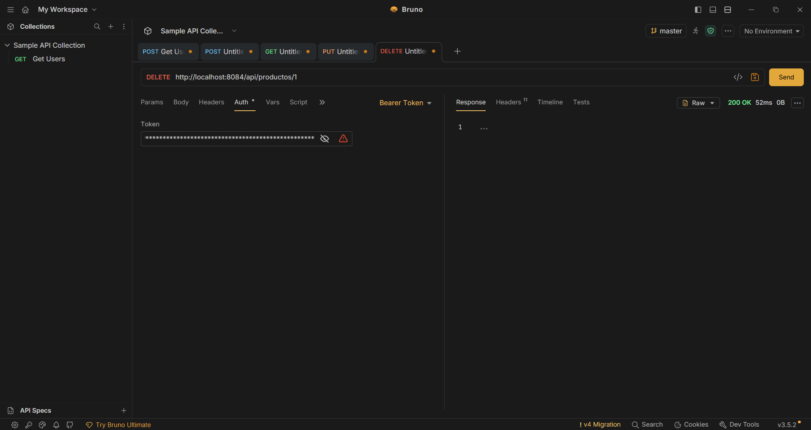

# AGVact4_t4 - API REST Protegida con Spring Security y JWT

**Alumno;** Gonzalez Valentin Adrian

**Materia:** Programación Web

Este repositorio tiene  la **Actividad 4**, la cual consiste en una API REST pura construida con Spring Boot, implementando un sistema de autenticación real mediante Spring Security y JSON Web Tokens, además de un CRUD completo protegido.

##  Tecnologías y Herramientas Utilizadas

* **Framework:** Spring Boot 3
* **Seguridad:** Spring Security + JWT (JSON Web Tokens)
* **Base de Datos:** MySQL + Spring Data JPA
* **Validación:** Spring Boot Starter Validation (DTOs)
* **Documentación de API:** Swagger UI (Springdoc OpenAPI)
* **Testing de API:** Bruno (Colección incluida en este repositorio)

---

##  Documentación Visual de la API (Swagger UI)

Para facilitar la prueba de los endpoints sin necesidad de clientes externos, esta API incluye una interfaz gráfica generada automáticamente con Swagger. 
Aquí se pueden ver físicamente todos los controladores y probarlos como si fueran formularios web.

**Ruta de acceso local:** `http://localhost:8084/swagger-ui/index.html`

---

##  Pruebas de Funcionamiento (Bruno)

Toda la API ha sido probada utilizando **Bruno**. La colección completa (`.bru`) se encuentra adjunta en la carpeta raíz de este repositorio para su verificación. A continuación, se documenta el flujo de trabajo y la protección de las rutas.

### Autenticación y Seguridad

**Registro de Usuario (POST /api/auth/register)**
Creación de un nuevo usuario encriptando la contraseña en la base de datos y devolviendo el Token inicial.

**Inicio de Sesión (POST /api/auth/login)**
Validación de credenciales y generación del JWT (`Bearer Token`) necesario para consumir el resto de la API.

---

### Operaciones CRUD Protegidas

**Crear Registro - POST (C)**
Creación de una nueva entidad en la base de datos enviando un JSON válido.

**Leer Registros - GET (R)**
Obtención de los datos almacenados (ya sea una lista completa o por ID).

**Actualizar Registro - PUT (U)**
Modificación completa de un registro existente validando su ID.

**Eliminar Registro - DELETE (D)**
Borrado de una entidad de la base de datos.

---
